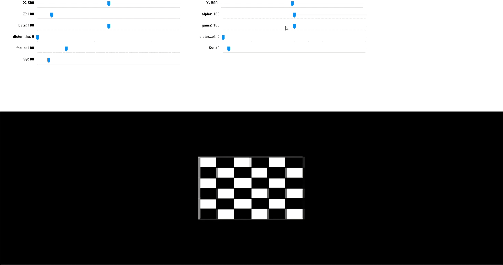

# Double Spherical Camera Model - GUI

Double spherical camera model is created to simulate a camera where **user can control** all its parameters **intrinsics and extrinsics** to get intuitions behind the this camera model and image formation.
The camera parameters could be changed and accordingly GUI visualizes the affect. It can be used to understand concepts of image formation and to understand the intrinsic and extrinsic camera parameters. <br>

The [double spherical camera model]('https://vision.in.tum.de/research/vslam/double-sphere') is a type of large field-of-view camera model that can used for fisheye cameras. The double spherical camera model assumes that a 3D point in world coordinate system is projected on to 2D pixel coordinates with intermediate steps of projecting point on two spheres as visualised below.

<p align="center">
  
</p>


## Instructions to run the GUI

1. Install the necessary libraries
```shell
pip install opencv-python
pip install numpy
```
2. Clone the repositoy
`git clone https://github.com/psb7/GUI--Double_Spherical_Camera_Model.git`

3. Run the GUI using the following command
`GUI_dsph.py`

### Camera Translation
<p align="center">
  
</p>


When you control the X, Y, Z trackerbars you are basically controlling the position of camera in the 3D world. The plane remains fixed and thus we can observe shifting of the plane as we move the camera. You can also objserve the changes in the last column of the camera projection matrix being prined in the right terminal.


### Camera Rotation
<p align="center">
  
</p>

When you control the alpha, beta, gamma trackbars you are controlling the rotations of camera in 3D world. This gives turning effect to the image.

### Camera Distortion Coefficients
<p align="center">
  
</p>

When you control the dsitortion_alpha and distortion_xi trackbars you are controlling the distortion coefficients. The computations performed in numpy also take into account the equation for lens distortions for a double spherical camera model camera.


## Code files
- `GUI_dsph.py` --> The file for GUI to play with camera parameters
- `GUI_dsph.py` --> The file to create a **Double Spherical Camera Model** object

## Refrences
[1] [Double Spherical Camera Model]('https://vision.in.tum.de/research/vslam/double-sphere') <br>
[2] [Virtual Cam]('https://github.com/kaustubh-sadekar/VirtualCam')
